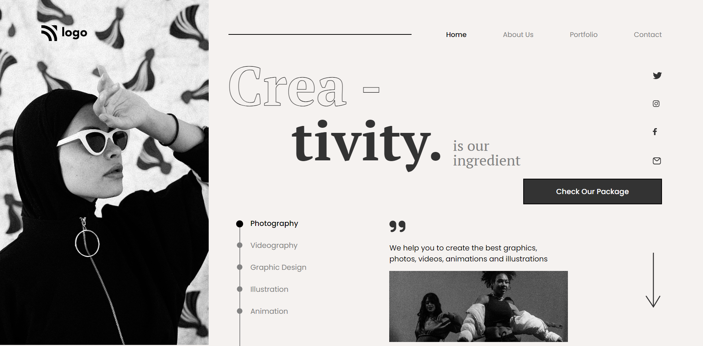

# Dance Landing Page

## :link: [See it live](https://fullstack-js-bc-project-14.netlify.app/)

###  **Remember:** It is <ins>Responsive</ins> for most of screen sizes below the width of 1550px.

## :clipboard: Learning Outcomes 

- Use of `flexbox` and CSS `positions`

